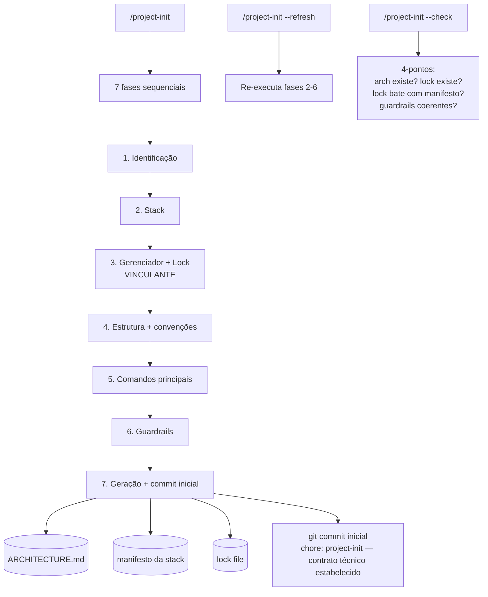

# C4 — Nível 3 (Componentes)

> Gerado pelo **Reversa Architect** em 2026-04-27 (refresh cirúrgico)
> Foco: container `mdcu` v3.0.0. Visão de "componentes lógicos" — F6 reformulada em 3 sub-blocos.

## Componentes do `mdcu` v3.0.0

```mermaid
C4Component
  title mdcu — Componentes lógicos (refresh: F6 em 3 sub-blocos)

  Container_Ext(engine, "Engine de IA", "")
  ContainerDb(mdcuFile, "_mdcu.md", "Filesystem")
  ContainerDb(archFile, "ARCHITECTURE.md", "Filesystem")
  ContainerDb(rsopDir, "rsop/* (com Anamnese F-5)", "Filesystem")
  Container_Ext(projectinit, "skill project-init v2.0.0", "")
  Container_Ext(projectsetup, "skill project-setup v0.1.0 NOVA", "")
  Container_Ext(rsop, "skill rsop v1.4.0", "")
  Container_Ext(commitsoap, "skill commit-soap v2.0.0 desacoplado", "")
  Container_Ext(mdcuseg, "skill mdcu-seg", "")
  Container_Ext(downstreamEngine, "Engine downstream desacoplável", "spec-kit / bmad / superpowers / libs / Reversa")
  Container_Ext(canon, "framework/principles.md", "F-1 a F-5 + P-8, P-9")

  Component_Boundary(mdcu, "skill mdcu v3.0.0") {
    Component(orchestrator, "Orquestrador F1-F6", "Markdown prose", "Gerencia transições de fase")
    Component(gateArch, "Gate de conformidade DUAL", "F1 → F2 check", "ARCHITECTURE.md presente E setup materializado")
    Component(listenF2, "Componente Escuta (F2)", "SIFE / Demanda × Queixa", "Escreve em _mdcu.md (S:)")
    Component(exploreF3, "Componente Exploração (F3)", "Patobiografia / sistema", "Escreve em _mdcu.md (O:)")
    Component(evalF4, "Componente Avaliação (F4)", "Hipótese + pró/contra", "Atualiza lista_problemas.md (com Tipo + Revisitar se consciente)")
    Component(planF5, "Componente Plano (F5)", "≥2 alternativas + trade-offs", "Decisão compartilhada com dever de alerta (RN-D-014)")

    Component_Boundary(f6, "F6 — Acompanhamento, tradução e fechamento") {
      Component(f6a, "F6.a Delegação", "Modo desacoplado OU monolítico declarado", "Invoca engine downstream OU executa ad-hoc com critério de saída")
      Component(f6b, "F6.b Acompanhamento", "Metaprotocolo de observação", "Disjuntor 2/2 + reenquadramento + releitura")
      Component(f6c, "F6.c Tradução + Fechamento", "Tradução de retorno + handoff longitudinal", "Decisão informada (RN-D-014) → /rsop soap → /commit-soap → delete _mdcu.md")
    }

    Component(disjuntor, "Disjuntor 2/2", "Counter no header _mdcu.md", "Aborta após 2 reenquadramentos (em F6.b)")
    Component(secCheck, "Rastreio de segurança 5-itens", "Aplicado em F1/F3/F5/F6", "Delegação condicional para mdcu-seg")
    Component(checklistSOAP, "Checklist qualidade SOAP NOVO", "10 itens binários", "Auto-aplicado em F6.c, não-bloqueante")
  }

  Rel(engine, orchestrator, "ativa via /mdcu")
  Rel(orchestrator, canon, "lê princípios canônicos como contexto")
  Rel(orchestrator, gateArch, "F1: chama")
  Rel(gateArch, archFile, "verifica presença")
  Rel(gateArch, projectinit, "INVOCA se ARCHITECTURE.md ausente")
  Rel(gateArch, projectsetup, "INVOCA se setup não materializado")
  Rel(orchestrator, rsopDir, "F1: lê dados_base+anamnese + lista_problemas + último SOAP")
  Rel(orchestrator, listenF2, "F2: ativa")
  Rel(listenF2, mdcuFile, "escreve S: (Demandas/Queixas/Notas)")
  Rel(orchestrator, exploreF3, "F3: ativa")
  Rel(exploreF3, mdcuFile, "escreve O:")
  Rel(orchestrator, secCheck, "F1/F3/F5/F6: aplica checklist")
  Rel(secCheck, mdcuseg, "delega quando dispara")
  Rel(orchestrator, evalF4, "F4: ativa")
  Rel(evalF4, rsopDir, "atualiza lista_problemas.md (Tipo+Revisitar se consciente RN-D-016)")
  Rel(orchestrator, planF5, "F5: ativa")
  Rel(planF5, archFile, "verifica guardrails")
  Rel(orchestrator, f6a, "F6: entra em F6.a")
  Rel(f6a, downstreamEngine, "DELEGA execução em modo desacoplado", "P-8")
  Rel(f6a, mdcuFile, "modo monolítico: registra invocação")
  Rel(f6a, f6b, "→ enquanto execução acontece")
  Rel(f6b, disjuntor, "ao reenquadrar: incrementa")
  Rel(disjuntor, mdcuFile, "lê/escreve contador no header")
  Rel(f6b, mdcuFile, "releitura periódica")
  Rel(f6b, f6c, "ao engine retornar: passa")
  Rel(f6c, mdcuFile, "releitura final integral")
  Rel(f6c, checklistSOAP, "auto-aplica antes de selar")
  Rel(f6c, rsop, "INVOCA /rsop soap (lê _mdcu.md inteiro)")
  Rel(f6c, commitsoap, "INVOCA /commit-soap (modo default — lê SOAP)")
  Rel(f6c, mdcuFile, "DELETA após commit confirmado")

  UpdateLayoutConfig($c4ShapeInRow="3", $c4BoundaryInRow="2")
```

## Detalhamento dos componentes do `mdcu`

| Componente | Linhas SKILL.md | Tipo | Estado |
|---|---|---|---|
| Orquestrador F1-F6 | 86-225 | Coordenador | Stateful (fase atual) |
| Gate de conformidade | 91-113 | Gate | Stateless — apenas verifica filesystem |
| Componente Escuta (F2) | 126-145 | Subskill | Escreve em S: |
| Componente Exploração (F3) | 149-163 | Subskill | Escreve em O: |
| Componente Avaliação (F4) | 167-178 | Subskill | Atualiza lista_problemas |
| Componente Plano (F5) | 182-202 | Subskill | Decisão compartilhada |
| Componente Execução (F6) | 206-224 | Subskill | Loop com disjuntor |
| Disjuntor 2/2 | 304-339 | Stateful counter | Persistido em `_mdcu.md` header |
| Rastreio de segurança | 228-262 | Subroutine | Aplicado em 4 fases |
| Fechamento | 220-222 | Cleanup | Encerra ciclo |

## Componentes do `rsop` (visão simplificada)

```mermaid
flowchart TD
  init["/rsop init"] --> create[Cria estrutura<br/>dados_base + lista + passivos + soap/]
  dados["/rsop dados"] --> rwDados[(dados_base.md)]
  lista["/rsop lista"] --> rAtivos[(lista_problemas.md)<br/>ativos apenas]
  passivos["/rsop passivos"] --> gateP{suspeita regressão<br/>OU pedido?}
  gateP -- sim --> rPas[(passivos.md)]
  gateP -- não --> blocked[NÃO consultar]
  soap["/rsop soap"] --> readMdcu[(_mdcu.md sessão)]
  readMdcu --> writeS[(soap/YYYY-MM-DD_*.md)]
  revisar["/rsop revisar"] --> migrate[ativos → passivos<br/>ou reclassificar]
  regress["/rsop regressao N"] --> rPas
  rPas --> reopen[reabre se sintoma compatível]
```

## Componentes do `mdcu-seg` (visão simplificada)

```mermaid
flowchart TD
  menu["/mdcu-seg"] --> dispatch{subcomando}
  dispatch -- threat-model --> stride[STRIDE 6-categorias<br/>tabela por componente]
  dispatch -- incidente --> f0[F0 IRP 5 etapas<br/>SUSPENDE MDCU]
  dispatch -- auditoria --> rev[Revisão trimestral<br/>de rsop/seguranca.md]
  dispatch -- status --> sum[Resumo: # ativos,<br/>última auditoria,<br/>incidentes abertos]
  stride --> writeMdcuOrSeg[escreve em _mdcu.md OU rsop/seguranca.md]
  f0 --> incidentSoap[(rsop/soap/YYYY-MM-DD_incidente-*.md)]
  rev --> updSec[(rsop/seguranca.md)<br/>+90d para próxima revisão]
```

## Componentes do `project-init` (visão simplificada)



## Lacuna 🔴 dos componentes

A "componentização" aqui é **lógica**, não física: tudo está em uma SKILL.md por skill. Não há separação de arquivo entre o "Gate de conformidade" e o "Orquestrador F1-F6" do `mdcu`. Em refactorings futuros, considerar dividir SKILL.md grandes em arquivos `references/*.md` invocáveis (padrão usado por `reversa/`).
