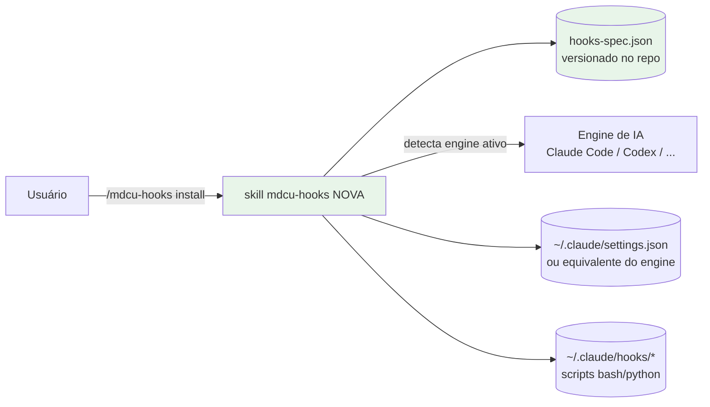

# C4 — Nível 2 (Containers)

> Gerado pelo **Reversa Architect** em 2026-04-27 (refresh cirúrgico)
> Adaptação: "containers" aqui são **as 6 skills** + **camada canônica `framework/`** (4 artefatos versionados) + **stores em filesystem** (artefatos persistentes) + git history + **engines downstream desacopláveis** (P-8).

```mermaid
C4Container
  title mdcu-framework — Containers (refresh 2026-04-27)

  Person(user, "Usuário", "Engenheiro / dev")

  System_Boundary(framework, "mdcu-framework") {
    Container(mdcu, "skill mdcu", "Markdown SKILL.md v3.0.0", "Orquestrador — F6 em 3 sub-blocos; modo monolítico declarado")
    Container(rsop, "skill rsop", "Markdown SKILL.md v1.4.0", "Prontuário longitudinal + checklist qualidade SOAP")
    Container(commitsoap, "skill commit-soap", "Markdown SKILL.md v2.0.0", "Selo longitudinal universal — SOAP default + --from + --inline")
    Container(projectinit, "skill project-init", "Markdown SKILL.md v2.0.0", "Extrai contrato → ARCHITECTURE.md (NÃO executa setup)")
    Container(projectsetup, "skill project-setup", "Markdown SKILL.md v0.1.0 NOVA", "Materializa contrato (manifesto + lock + estrutura); modo desacoplado/monolítico")
    Container(mdcuseg, "skill mdcu-seg", "Markdown SKILL.md v1.0.0", "Segurança — STRIDE / F0 IRP / auditoria trimestral")

    Container_Boundary(canon, "framework/ (camada canônica versionada)") {
      Container(principles, "principles.md", "Markdown canônico", "F-1 a F-5 + P-8, P-9 — fonte de verdade")
      Container(diagram, "architecture-diagram.md", "Markdown canônico", "Anatomia das 4 camadas")
      Container(glossary, "glossary.md", "Markdown canônico", "Termos canônicos + RN-D-014/015/016")
    }
  }

  Container_Ext(engine, "Engine de IA", "Claude Code / Codex / Cursor / Gemini", "Carrega skills, interpreta comandos /")
  Container_Ext(engineDownstream, "Engines downstream desacopláveis", "spec-kit / superpowers / bmad / libs / Reversa", "Análise/Spec/Código/Teste — DELEGADOS pelo MDCU em F6.a (P-8)")
  Container_Ext(scaffolding, "Engine de scaffolding", "cookiecutter / yeoman / plop / copier / cargo-generate", "Setup técnico desacoplado (project-setup modo desacoplado)")

  ContainerDb(mdcuFile, "_mdcu.md", "Filesystem", "Sessão transitória — deletada pós-SOAP")
  ContainerDb(rsopDir, "rsop/ (dados_base+anamnese, lista_problemas, passivos, soap/)", "Filesystem", "Prontuário longitudinal — schema enriquecido (Tipo + Revisitar)")
  ContainerDb(secFile, "rsop/seguranca.md", "Filesystem", "Auditoria trimestral")
  ContainerDb(archFile, "ARCHITECTURE.md", "Filesystem", "Contrato técnico extraído por project-init")
  ContainerDb(manifestFile, "Manifesto (package.json / pyproject.toml / ...)", "Filesystem", "Materializado por project-setup")
  ContainerDb(lockFile, "Lock file (poetry.lock / package-lock / Cargo.lock / ...)", "Filesystem", "Versões pinadas — sempre commitado")
  ContainerDb(gitignore, ".gitignore", "Filesystem", "Materializado por project-setup conforme stack")
  ContainerDb(gitHist, "Git history", "Repositório git", "Commits-SOAP (qualquer marco) e micro-commits")

  Rel(user, engine, "comandos via terminal/IDE/web")
  Rel(engine, mdcu, "carrega via trigger description")
  Rel(engine, rsop, "carrega")
  Rel(engine, commitsoap, "carrega")
  Rel(engine, projectinit, "carrega")
  Rel(engine, projectsetup, "carrega")
  Rel(engine, mdcuseg, "carrega")
  Rel(engine, principles, "lê como contexto canônico")

  Rel(mdcu, mdcuFile, "cria/lê/escreve/deleta", "ciclo de vida")
  Rel(mdcu, rsopDir, "lê dados_base+anamnese + lista_problemas + último SOAP em F1")
  Rel(mdcu, archFile, "lê em F1, F5 (gate dual)")
  Rel(mdcu, projectinit, "INVOCA via /project-init", "gate F1→F2 dual")
  Rel(mdcu, projectsetup, "INVOCA via /project-setup", "gate F1→F2 dual NOVA")
  Rel(mdcu, engineDownstream, "DELEGA execução em F6.a (modo desacoplado)", "P-8")
  Rel(mdcu, rsop, "INVOCA /rsop soap", "F6.c fechamento")
  Rel(mdcu, commitsoap, "INVOCA /commit-soap", "F6.c selo")
  Rel(mdcu, mdcuseg, "INVOCA /mdcu-seg [tipo]", "gatilhos F1/F3/F5/F6")

  Rel(rsop, rsopDir, "escreve em todos os componentes")
  Rel(rsop, mdcuFile, "lê para hidratar S e O do SOAP")

  Rel(commitsoap, rsopDir, "lê SOAP recente em soap/ (modo default)")
  Rel(commitsoap, gitHist, "produz commit A:/P:/Refs: para QUALQUER marco")

  Rel(projectinit, archFile, "cria/edita (não executa setup)")
  Rel(projectinit, projectsetup, "INVOCA ao final da fase 7", "handoff")

  Rel(projectsetup, manifestFile, "cria via engine de scaffolding OU monolítico")
  Rel(projectsetup, lockFile, "garante existência + commit conjunto com manifesto")
  Rel(projectsetup, gitignore, "configura conforme stack")
  Rel(projectsetup, scaffolding, "DELEGA setup em modo desacoplado", "P-8")
  Rel(projectsetup, commitsoap, "INVOCA --inline para selo inicial", "P-9")
  Rel(projectsetup, gitHist, "indireto via commit-soap --inline")

  Rel(mdcuseg, secFile, "cria/atualiza (revisão trimestral)")
  Rel(mdcuseg, rsopDir, "espelha vulnerabilidades; cria SOAP-incidente")
  Rel(mdcuseg, mdcu, "SUSPENDE em F0")

  UpdateLayoutConfig($c4ShapeInRow="3", $c4BoundaryInRow="1")
```

## Comportamento de carga das skills

Engines de IA carregam skills sob demanda, baseado no **frontmatter `description`** que contém triggers (palavras-chave, comandos `/`, contextos). O modelo de carga típico:
- Skill **só é injetada no contexto** quando trigger ativa.
- Skills carregadas concomitantemente: comum (ex: `mdcu` + `rsop` + `commit-soap` numa sessão de fechamento).
- Token cost: a description fica sempre no system prompt; o corpo só quando ativada.

## Comunicação entre containers

| Tipo | Como |
|---|---|
| **Invocação direta** | `/comando` que dispara outra skill (ex: `/mdcu` invoca `/project-init` no gate F1) |
| **Leitura de artefato** | Skill lê arquivo produzido por outra (ex: `commit-soap` lê SOAP do `rsop`) |
| **Escrita coordenada** | Múltiplas skills atualizam o mesmo arquivo (ex: `mdcu` em F4 e `rsop` via `/rsop revisar` ambos escrevem em `lista_problemas.md`) |
| **Suspensão de fluxo** | `mdcu-seg incidente` suspende `mdcu` ativo (preserva `_mdcu.md`) |

## Lacunas 🔴 do C4 Containers

- **Não há "broker" entre skills.** Coordenação depende do agente respeitar a sequência prescrita. Sem fila, sem evento, sem RPC.
- **Não há controle de concorrência sobre `lista_problemas.md`** quando duas skills (mdcu F4 e rsop revisar) escrevem em momentos próximos. Mitigado por uso sequencial dentro de uma sessão de IA.

## Container futuro (roadmap, decidido em 2026-04-27 P8) 🟢

**Resolução da assimetria D-004:**
- `mdcu-hooks/SKILL.md` — nova skill (versão inicial `0.1.0`).
- `mdcu-hooks/hooks-spec.json` — JSON declarativo dos hooks que o framework prescreve (`UserPromptSubmit`, `commit-msg`, anti-deriva).
- Comandos: `/mdcu-hooks install` (aplica spec no engine ativo), `/mdcu-hooks check` (verifica conformidade), `/mdcu-hooks uninstall` (remove).
- Vantagem: enforcement passa a estar **versionado dentro do repo** — quem clona recebe a spec e pode aplicar.
