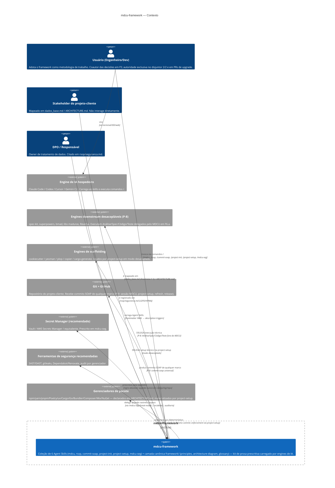

# C4 — Nível 1 (Contexto)

> Gerado pelo **Reversa Architect** em 2026-04-27
> Adaptação: o "sistema" no centro é o framework metodológico (não uma aplicação web). "Personas" e "sistemas externos" foram reinterpretados.

## Notas sobre o contexto

- **O sistema central NÃO é executável** — é prosa interpretada pelo engine. Reinterpretar "sistema" como "kit de prescrições" é necessário.
- **Personas:**
  - `Usuário` é o ator principal. Único humano com autoridade decisória.
  - `Stakeholder` e `DPO` são roles informacionais — não consomem o framework, mas o framework os referencia.
- **Sistemas externos:**
  - `Engine de IA` é o "runtime" — sem ele, as skills são apenas Markdown.
  - `Git + GitHub` é o destino dos artefatos permanentes (commits-SOAP).
  - `Secret Manager` e `Ferramentas de segurança` são **prescritos** pelo framework (recomendações), não executados por ele.
  - `Gerenciadores de pacote` são escolhidos via `/project-init` segundo a stack.

## Lacunas 🔴 do C4 Context

- **Múltiplos engenheiros em paralelo:** o framework não modela colaboração multi-humano (ver `permissions.md` LAC). Cada usuário aparenta operar isoladamente.
- **Outros agentes consumindo SOAPs:** SOAPs antigos podem ser lidos por agentes futuros, mas não há contrato sobre **quais agentes** podem ler **quais SOAPs** (privacidade/sensibilidade).

## Mudanças no contexto desde 2026-04-27 17:44 (refresh)

- **6 skills** (era 5) — `project-setup` adicionado por split estrutural de `project-init` (P-8)
- **Camada canônica `framework/`** declarada — separa fonte de verdade versionada de Reversa output gitignored
- **Engines downstream desacopláveis** explicitados como sistema externo (P-8) — antes eram implícitos
- **Engines de scaffolding** explicitados — antes parte do project-init monolítico
- **commit-soap desacoplado** — P-9: cobre marcos longitudinais arbitrários, não só sessão MDCU
