# ERD completo — mdcu-framework

> Gerado pelo **Reversa Architect** em 2026-04-27
> Adaptação: o framework não tem DB. As "entidades" são **artefatos em filesystem**; "relacionamentos" são **referências/leituras/escritas**. Mermaid `erDiagram` adaptado para esse domínio.

```mermaid
erDiagram
  ARCHITECTURE_MD ||--o{ MDCU_SESSION : "lido em F1/F5/F6"
  ARCHITECTURE_MD ||--|| LOCK_FILE : "exige (project-init F3)"
  ARCHITECTURE_MD ||--|| MANIFEST : "exige"

  DADOS_BASE ||--o{ MDCU_SESSION : "lido em F1"

  LISTA_PROBLEMAS ||--o{ MDCU_SESSION : "lido em F1"
  LISTA_PROBLEMAS ||--o{ MDCU_SESSION : "atualizado em F4"
  LISTA_PROBLEMAS ||--o{ SOAP : "referenciado por # em A"
  LISTA_PROBLEMAS ||--o{ PASSIVOS : "migra resolvidos (rsop revisar)"
  LISTA_PROBLEMAS ||--o{ SECURITY_AUDIT : "espelha vulnerabilidades"

  PASSIVOS ||--o{ LISTA_PROBLEMAS : "reabre via /rsop regressao"
  PASSIVOS }o--o{ MDCU_SESSION : "consultado só por suspeita ou pedido"

  MDCU_SESSION ||--|| SOAP : "destila em fechamento"
  MDCU_SESSION ||--o| INCIDENT_SOAP : "preserva intacto se F0 dispara"

  SOAP ||--|| COMMIT_SOAP_MSG : "fonte de A+P"
  SOAP }o--|| LISTA_PROBLEMAS : "refs # em A"

  INCIDENT_SOAP ||--|| SECURITY_AUDIT : "indexado em histórico de incidentes"

  SECURITY_AUDIT ||--o{ MDCU_SESSION : "consultado quando rastreio dispara"

  COMMIT_SOAP_MSG ||--|| GIT_HISTORY : "persistido em"

  ARCHITECTURE_MD {
    section identificacao
    section stack
    section dependencias_gerenciador_manifesto_lock
    section estrutura_diretorios
    section convencoes
    section comandos_principais
    section guardrails_invariantes
    section escopo
    section adrs
  }

  DADOS_BASE {
    string projeto
    date atualizado
    section identificacao_tecnica "Propósito Responsáveis Stakeholders"
    section stack "Linguagens Infra Repositório"
    section anamnese_F5_NOVO "Queixa principal histórica + Padrão demanda recorrente + Valores declarados + Contexto biográfico + Vieses + Gatilhos típicos"
    list dividas_conhecidas
  }

  LISTA_PROBLEMAS {
    int_or_aceito_arquivado hash_id "estável; nunca reciclado; ou prefixo [aceito-arquivado] RN-D-015"
    string problema "prefixo [A]/[M]/[B]"
    enum_or_omitted tipo_NOVO "consciente | omitted=acidental (RN-D-016)"
    string_or_omitted revisitar_NOVO "data ISO ou condição livre; obrigatório se Tipo=consciente"
    date desde
    date ult_soap
  }

  PASSIVOS {
    int hash_id "mesmo da lista_problemas"
    string problema
    string ativo_em "YYYY-MM → YYYY-MM"
    string fechado_por
    date fechado_em
    enum reativavel "não / sim — vigiar recorrência (segurança) / sim — motivo"
  }

  MDCU_SESSION {
    string header "# Sessão YYYY-MM-DD — projeto/tema"
    counter tentativas_reenquadramento "0/2 → 1/2 → 2/2"
    section F1
    section F2 "S: Demandas Queixas Notas"
    section F3 "O: bullets fonte"
    section F4 "hipótese pró/contra"
    section F5 "≥2 alternativas trade-offs"
    section F6 "execução + reflexão rascunho"
  }

  SOAP {
    string header "# SOAP YYYY-MM-DD — contexto"
    list problemas_refs "#N #M"
    bullets S_demandas
    bullets S_queixas
    bullets S_notas "SIFE — opcional"
    bullets O "telegráfico fonte explícita"
    numbered_list A "max 5 palavras refs #"
    numbered_list P "1:1 com A 1 linha cada"
    string R "1 linha ou omitir"
  }

  INCIDENT_SOAP {
    string tipo "incidente (F0)"
    enum severidade "L1 L2 L3 L4"
    numbered_list etapas_F0 "1-Identificação 2a-Cont.curta 2b-Cont.média 3-Erradicação 4-Recuperação 5-Postmortem"
  }

  SECURITY_AUDIT {
    date ultima_revisao
    date proxima_revisao "+90 dias"
    table classificacao_dados "Restrito Confidencial Interno Público"
    section regime_auditoria "SAST DAST Dep_scan Secret_scan Pentest Code_review"
    section gestao_segredos
    section conformidade "LGPD HIPAA PCI-DSS DPO base_legal retencao"
    table historico_incidentes "12 meses"
    list vulnerabilidades_ativas "espelho filtrado"
  }

  COMMIT_SOAP_MSG {
    string linha_A "≤ 72 chars"
    string linha_P
    enum_fonte_NOVO source "default=último_SOAP | --from <path> | --inline"
    path refs "rsop/soap/*.md OR ARCHITECTURE.md OR custom"
    enum_marco_NOVO marco_type "sessão_MDCU | project-setup_inicial | refresh_estrutural | release_tag | feature_merge"
    none co_authored_by "PROIBIDO RN-D-013"
  }

  GIT_HISTORY {
    list commits_soap "git log --grep='A:'"
    list micro_commits "git log --invert-grep --grep='A:'"
  }

  LOCK_FILE {
    string path "package-lock.json / poetry.lock / Cargo.lock / etc"
    string materializador_NOVO "project-setup (modo desacoplado via engine OR monolítico declarado)"
    boolean commitado "TRUE — sempre"
    boolean gitignored "FALSE — nunca"
  }

  MANIFEST {
    string path "package.json / pyproject.toml / Cargo.toml / etc"
    string materializador_NOVO "project-setup (não mais project-init que só extrai contrato)"
    string politica_versao "ex ^x.y.z no manifesto"
  }

  GITIGNORE_NOVO {
    string path ".gitignore"
    string materializador "project-setup conforme stack"
    constraint nunca_inclui "lock file (sempre commitado)"
  }

  FRAMEWORK_PRINCIPLES_NOVO {
    string path "framework/principles.md"
    enum lifecycle "canonical_versioned"
    list F_principles "F-1 a F-5 fundacionais"
    list P_principles "P-8 P-9 arquiteturais canônicos"
    constraint precedence "framework/ > _reversa_sdd/ em caso de tensão"
  }

  FRAMEWORK_DIAGRAM_NOVO {
    string path "framework/architecture-diagram.md"
    enum lifecycle "canonical_versioned"
    int camadas "4 (interface humana / delegação técnica / acompanhamento longitudinal / fundação)"
    section direcionalidade_setas "MCCP→MDCU; Usuário↔MDCU bidirecional; etc"
  }

  FRAMEWORK_GLOSSARY_NOVO {
    string path "framework/glossary.md"
    enum lifecycle "canonical_versioned"
    list termos_canonicos "Satisfação clínica + Decisão informada + Composição orquestrador + Anamnese + Engine downstream desacoplável + Precisa-resolver + Dívida consciente×acidental"
    list rn_d_canonicas "RN-D-014 RN-D-015 RN-D-016"
  }
```

## Cardinalidades — explicação

| Relação | Cardinalidade | Significado |
|---|---|---|
| `ARCHITECTURE_MD ||--o{ MDCU_SESSION` | 1 : N | Um contrato técnico, várias sessões MDCU lendo-o |
| `ARCHITECTURE_MD ||--|| LOCK_FILE` | 1 : 1 | Cada `ARCHITECTURE.md` exige um lock determinístico |
| `LISTA_PROBLEMAS ||--o{ PASSIVOS` | 1 : N | Lista ativa migra para passivos; `#` é estável |
| `MDCU_SESSION ||--|| SOAP` | 1 : 1 | Cada sessão fechada produz um SOAP (não há SOAP múltiplo por sessão) |
| `MDCU_SESSION ||--o| INCIDENT_SOAP` | 1 : 0..1 | Sessão preservada por F0 pode (ou não) gerar SOAP-incidente |
| `SOAP ||--|| COMMIT_SOAP_MSG` | 1 : 1 | Cada SOAP de fechamento gera um commit-soap |
| `SOAP }o--|| LISTA_PROBLEMAS` | N : 1 | Vários SOAPs podem referenciar o mesmo `#` (história longitudinal) |

## Constraints transversais

1. **`#` (hash_id de problema) é PK estável.** Não reaproveita entre estados (ativo↔passivo) nem entre projetos.
2. **`COMMIT_SOAP_MSG.co_authored_by` é negativo:** ausência obrigatória.
3. **`LOCK_FILE.gitignored = false`** é regra absoluta do framework.
4. **`SECURITY_AUDIT.proxima_revisao` = ultima_revisao + 90 dias.** Sem exceção.
5. **`INCIDENT_SOAP` ESTENDE `SOAP`** — herda todos os campos S/O/A/P/R, adiciona `tipo`, `severidade`, `etapas_F0`.

## Lacunas 🔴 do ERD

- Não há entidade que represente **ADRs** explicitamente — eles são citados em `ARCHITECTURE.md` como links e em `_mdcu.md` quando emergem em F5, mas o framework não prescreve um diretório `adrs/` formal (embora o Reversa esteja gerando um `_reversa_sdd/adrs/` como artefato externo).
- Naming convention de `<contexto>` em `SOAP` não é restrita por schema.
- Não há "índice" de SOAPs (um arquivo `rsop/soap/INDEX.md`?) — buscar contexto exige `ls rsop/soap/` ou `git log --grep`. Para projetos longevos, isso pode ficar custoso.

## Mudanças do refresh 2026-04-27

- **DADOS_BASE** ganhou seção `anamnese_F5` (queixa principal histórica + padrão recorrente + valores + contexto biográfico + vieses + gatilhos)
- **LISTA_PROBLEMAS** ganhou colunas `tipo` (consciente|omitted=acidental — RN-D-016) e `revisitar` (livre, obrigatório se consciente); coluna `#` aceita prefixo `[aceito-arquivado]` (RN-D-015)
- **COMMIT_SOAP_MSG** ganhou `source` (default=SOAP | --from | --inline) e `marco_type` (sessão MDCU OR project-setup OR refresh OR release OR feature-merge) — desacoplamento P-9
- **MANIFEST** e **LOCK_FILE** agora declaram `materializador = project-setup` (não mais project-init)
- **NOVO: GITIGNORE** materializado por project-setup conforme stack
- **NOVO: FRAMEWORK_PRINCIPLES** (framework/principles.md) — fonte canônica versionada; precedence sobre `_reversa_sdd/`
- **NOVO: FRAMEWORK_DIAGRAM** (framework/architecture-diagram.md) — anatomia de 4 camadas
- **NOVO: FRAMEWORK_GLOSSARY** (framework/glossary.md) — termos canônicos + RN-D-014/015/016
