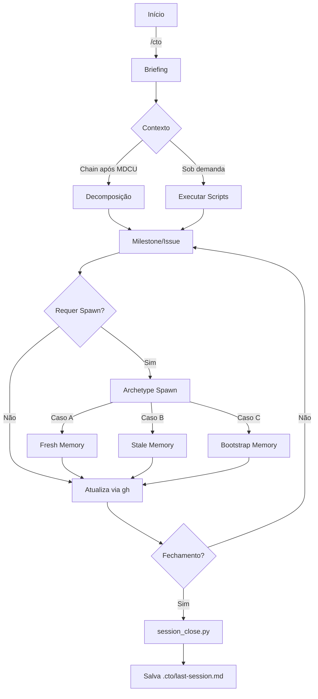

```mermaid
graph TD
  Start[Início] -->|/cto| A[Briefing]
  A --> B{Contexto}
  B -->|Chain após MDCU| C[Decomposição]
  B -->|Sob demanda| D[Executar Scripts]
  C --> E[Milestone/Issue]
  D --> E
  E --> F{Requer Spawn?}
  F -->|Sim| G[Archetype Spawn]
  G -->|Caso A| H[Fresh Memory]
  G -->|Caso B| I[Stale Memory]
  G -->|Caso C| J[Bootstrap Memory]
  F -->|Não| K[Atualiza via gh]
  H --> K
  I --> K
  J --> K
  K --> L{Fechamento?}
  L -->|Sim| M[session_close.py]
  M --> N[Salva .cto/last-session.md]
  L -->|Não| E
```
