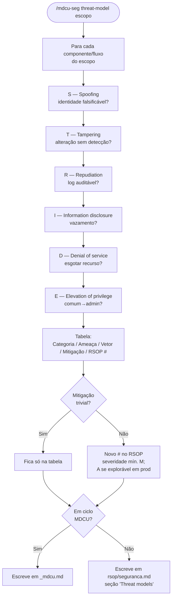
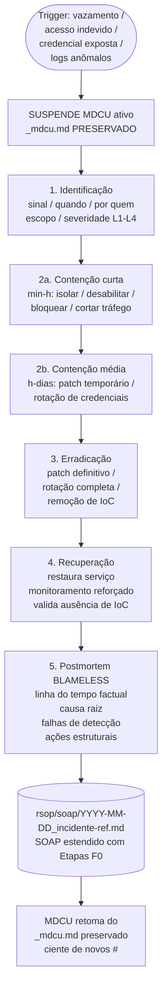
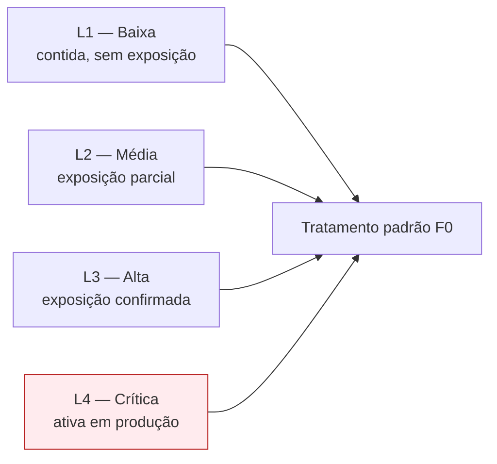
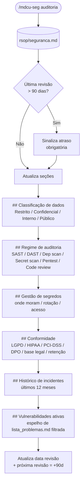

# Fluxograma — `mdcu-seg`

## Domínio 1 — Threat modeling (STRIDE)



## Domínio 2 — F0 (contenção de incidente)



## Severidade de incidente (L1–L4)



## Domínio 3 — Auditoria trimestral



## Gatilhos de delegação MDCU → mdcu-seg

```mermaid
flowchart LR
  F1MDCU[MDCU F1] -- '#A' segurança ativo --> Aud[/mdcu-seg auditoria]
  F3MDCU[MDCU F3] -- item 1 PII<br/>ou item 2 auth --> TM[/mdcu-seg threat-model]
  F5MDCU[MDCU F5] -- alternativa falha rastreio --> TM
  F6MDCU[MDCU F6] -- sinal de incidente --> F0[/mdcu-seg incidente<br/>IMEDIATO — suspende ciclo]
  Any[Qualquer fase] -- vazamento / breach /<br/>CVE crítico / LGPD --> Disp[delegar conforme contexto]
```
