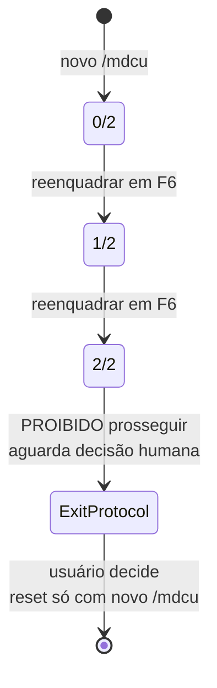
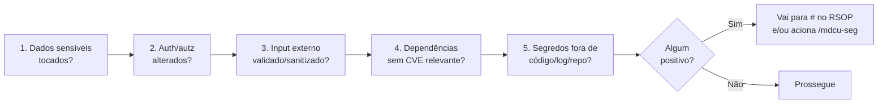

# Fluxograma — `mdcu`

## Ciclo principal F1 → F6 (com gates)

```mermaid
flowchart TD
  Start([/mdcu]) --> CreateFile[Cria _mdcu.md<br/>Reenquadramento: 0/2]
  CreateFile --> F1[F1 Preparação]
  F1 --> Gate1{ARCHITECTURE.md<br/>existe?}
  Gate1 -- Não --> Interrupt[INTERROMPE MDCU]
  Interrupt --> Invoke[Invoca /project-init]
  Invoke --> F1
  Gate1 -- Sim --> F1cont[Lê stack/guardrails<br/>Lê rsop/dados_base, lista_problemas, último SOAP<br/>Verifica vieses + reenquadramento pendente<br/>Rastreio: # segurança ativo?]
  F1cont --> F2[F2 Escuta — 2min de ouro]
  F2 --> WriteS[Escreve em _mdcu.md<br/>S: Demandas / Queixas / Notas SIFE]
  WriteS --> F3[F3 Exploração]
  F3 --> WriteO[Escreve em _mdcu.md<br/>O: fatos, medidas, fontes]
  WriteO --> Sec3{Rastreio segurança<br/>itens 1 ou 2?}
  Sec3 -- Sim --> Seg3[Invoca /mdcu-seg threat-model]
  Seg3 --> F4
  Sec3 -- Não --> F4[F4 Avaliação — hipótese]
  F4 --> UpdList[Atualiza rsop/lista_problemas.md<br/>novo # ou evolui descrição]
  UpdList --> F5[F5 Plano — decisão compartilhada]
  F5 --> Alt[≥2 alternativas + trade-offs<br/>Precedência: skills > MCPs > libs > padrões > original]
  Alt --> Sec5{Alternativa viola<br/>guardrail?}
  Sec5 -- Sim --> Refresh[Exige /project-init --refresh]
  Refresh --> F5
  Sec5 -- Não --> F6[F6 Execução]
  F6 --> Reread[RELÊ _mdcu.md INTEIRO]
  Reread --> Exec[Executa plano<br/>Micro-commits permitidos<br/>Manifesto+lock no MESMO commit]
  Exec --> Reframe{Precisa<br/>reenquadrar?}
  Reframe -- Sim --> Counter[Incrementa contador]
  Counter --> Disjuntor{Contador<br/>== 2/2?}
  Disjuntor -- Sim --> Abort[DISJUNTOR — Exit Protocol<br/>Aguarda decisão humana]
  Disjuntor -- Não --> F2
  Reframe -- Não --> Done{Execução<br/>concluída?}
  Done -- Não --> Exec
  Done -- Sim --> Reread2[RELÊ _mdcu.md]
  Reread2 --> Soap[/rsop soap]
  Soap --> Commit[/commit-soap]
  Commit --> Delete[DELETA _mdcu.md]
  Delete --> End([fim])
```

## Disjuntor 2/2 (zoom)



## Rastreio de segurança (5 itens binários)

Aplicado em F1, F3, F5, F6:


