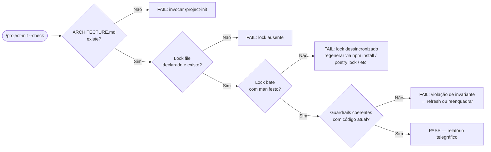
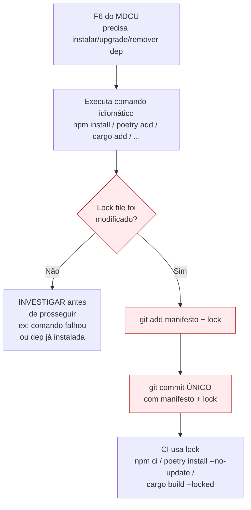

# Fluxograma — `project-init`

## Fluxo das 7 fases

```mermaid
flowchart TD
  Start([/project-init]) --> Check0{ARCHITECTURE.md<br/>já existe?}
  Check0 -- Sim --> AbortNew[Aborta — sugere<br/>--refresh]
  Check0 -- Não --> F1[F1 Identificação]
  F1 --> Reuse{rsop/dados_base.md<br/>já tem nome/propósito?}
  Reuse -- Sim --> F2[F2 Seleção de stack]
  Reuse -- Não --> Ask1[Pergunta: nome,<br/>propósito, responsáveis,<br/>stakeholders, raiz]
  Ask1 --> F2
  F2 --> Validate2[Critério: consolidado > experimental<br/>Exótico → ADR]
  Validate2 --> F3[F3 Gerenciador + Lock — VINCULANTE]
  F3 --> Lookup[Lookup tabela canônica<br/>12 stacks suportadas]
  Lookup --> Found{Stack está<br/>na tabela?}
  Found -- Sim --> Apply[Aplica mapeamento<br/>determinístico]
  Found -- Não --> Research[Pesquisa lock canônico<br/>da comunidade]
  Research --> Confirm[Confirma com usuário]
  Confirm --> Apply
  Apply --> LockOK{Lock determinístico<br/>viável?}
  LockOK -- Não --> AbortF3[ABORTA — exige<br/>redefinição de stack]
  LockOK -- Sim --> F4[F4 Estrutura + convenções]
  F4 --> Layout[src/ tests/ rsop/ docs/<br/>+ lint format naming branches]
  Layout --> F5[F5 Comandos principais]
  F5 --> Cmds[install / dev / test / build /<br/>lint / format / migrate / seed]
  Cmds --> F6[F6 Guardrails / invariantes]
  F6 --> Guards[Decisões irreversíveis<br/>+ limites de escopo<br/>+ regras de segurança estrutural]
  Guards --> F7[F7 Geração e commit inicial]
  F7 --> CreateArch[Cria ARCHITECTURE.md]
  CreateArch --> InitMgr[Inicializa gerenciador<br/>npm init / poetry init / cargo init / go mod init / ...]
  InitMgr --> InstallDeps[Instala deps iniciais<br/>→ GERA LOCK FILE]
  InstallDeps --> GitInit[git init se necessário<br/>+ .gitignore por stack<br/>'NUNCA' lock file no .gitignore]
  GitInit --> Commit[Commit inicial canônico:<br/>chore: project-init — contrato técnico estabelecido<br/>A: ...<br/>P: ...<br/>Refs: ARCHITECTURE.md]
  Commit --> End([fim])
```

## Sub-fluxo: validação `--check`

```mermaid
flowchart LR
  Start([/project-init --check]) --> C1{ARCHITECTURE.md<br/>existe?}
  C1 -- Não --> Fail1[FAIL: invocar /project-init]
  C1 -- Sim --> C2{Lock file<br/>declarado e existe?}
  C2 -- Não --> Fail2[FAIL: lock ausente]
  C2 -- Sim --> C3{Lock bate<br/>com manifesto?}
  C3 -- Não --> Fail3[FAIL: lock dessincronizado<br/>regenerar via npm install / poetry lock / etc.]
  C3 -- Sim --> C4{Guardrails coerentes<br/>com código atual?}
  C4 -- Não --> Fail4[FAIL: violação de invariante<br/>→ refresh ou reenquadrar]
  C4 -- Sim --> Pass[PASS — relatório telegráfico]
```

## Gestão Determinística de Dependências (DDD)

```mermaid
flowchart TD
  Start[F6 do MDCU<br/>precisa instalar/upgrade/remover dep] --> Cmd[Executa comando idiomático<br/>npm install / poetry add / cargo add / ...]
  Cmd --> CheckLock{Lock file foi<br/>modificado?}
  CheckLock -- Não --> Investigate[INVESTIGAR antes<br/>de prosseguir<br/>ex: comando falhou<br/>ou dep já instalada]
  CheckLock -- Sim --> Stage[git add manifesto + lock]
  Stage --> Commit[git commit ÚNICO<br/>com manifesto + lock]
  Commit --> CI[CI usa lock<br/>npm ci / poetry install --no-update /<br/>cargo build --locked]

  classDef strict fill:#ffebee,stroke:#b71c1c;
  class CheckLock,Stage,Commit strict
```
