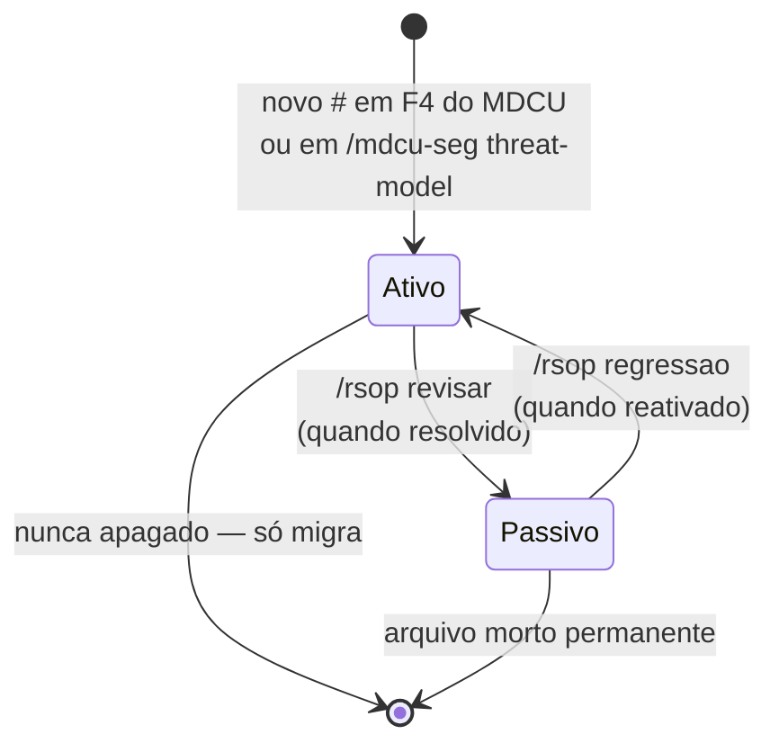
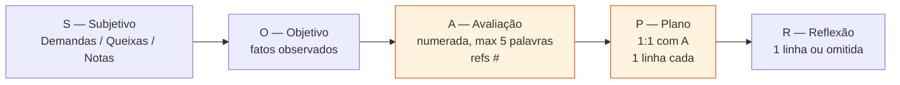

# Fluxograma — `rsop`

## Comandos e estados dos artefatos

```mermaid
flowchart TD
  Init([/rsop init]) --> CreateAll[Cria estrutura:<br/>dados_base.md<br/>lista_problemas.md<br/>passivos.md<br/>soap/]

  Dados([/rsop dados]) --> ReadDados[(dados_base.md)]
  ReadDados --> WriteDados[Atualiza dados_base.md]

  Lista([/rsop lista]) --> ReadLista[(lista_problemas.md)]

  Passivos([/rsop passivos]) --> CheckPas{Suspeita regressão<br/>OU pedido explícito?}
  CheckPas -- Sim --> ReadPas[(passivos.md)]
  CheckPas -- Não --> Block[NÃO consultar — passivos<br/>ficam invisíveis ao agente]

  Soap([/rsop soap]) --> ReadMdcu[(_mdcu.md sessão atual)]
  ReadMdcu --> Hidrata[Hidrata S de S:<br/>e O de O:<br/>NÃO usa memória de chat]
  Hidrata --> CreateSoap[(soap/YYYY-MM-DD_contexto.md)]
  CreateSoap --> RefList[Referencia # de<br/>lista_problemas.md]

  Revisar([/rsop revisar]) --> ReadAtivos[(lista_problemas.md)]
  ReadAtivos --> Triagem{Para cada #}
  Triagem --> Resolved{Resolvido?}
  Resolved -- Sim --> Move[Move # para<br/>passivos.md com:<br/>- Fechado por<br/>- Fechado em<br/>- Reativável?]
  Resolved -- Não --> Reclass[Reclassifica severidade<br/>e/ou descrição]

  Regress([/rsop regressao N]) --> ReadPas
  ReadPas --> Found{Encontra # antigo<br/>com sintoma similar?}
  Found -- Sim --> Reopen[Reabre em<br/>lista_problemas.md<br/>Marca passivos.md<br/>'reaberto em [data]']
  Found -- Não --> NoOp[Sem ação]

  Status([/rsop status]) --> Summary[Resumo:<br/>data dados base<br/>#ativos / #passivos<br/>último SOAP]
```

## Migração de problema entre estados



## Estrutura do SOAP (cadeia de coerência)


