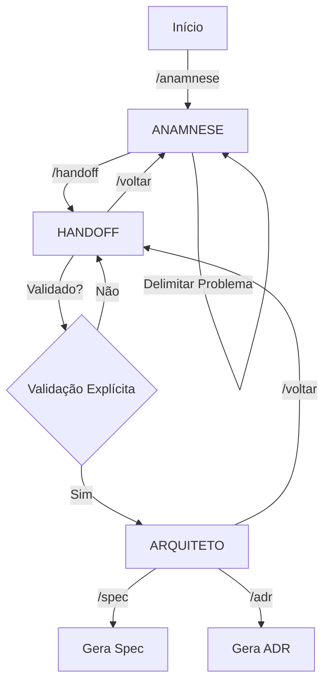

```mermaid
graph TD
  Start[Início] -->|/anamnese| A[ANAMNESE]
  A -->|Delimitar Problema| A
  A -->|/handoff| B[HANDOFF]
  B -->|Validado?| V{Validação Explícita}
  V -->|Sim| C[ARQUITETO]
  V -->|Não| B
  C -->|/spec| S[Gera Spec]
  C -->|/adr| D[Gera ADR]
  C -->|/voltar| B
  B -->|/voltar| A
```
