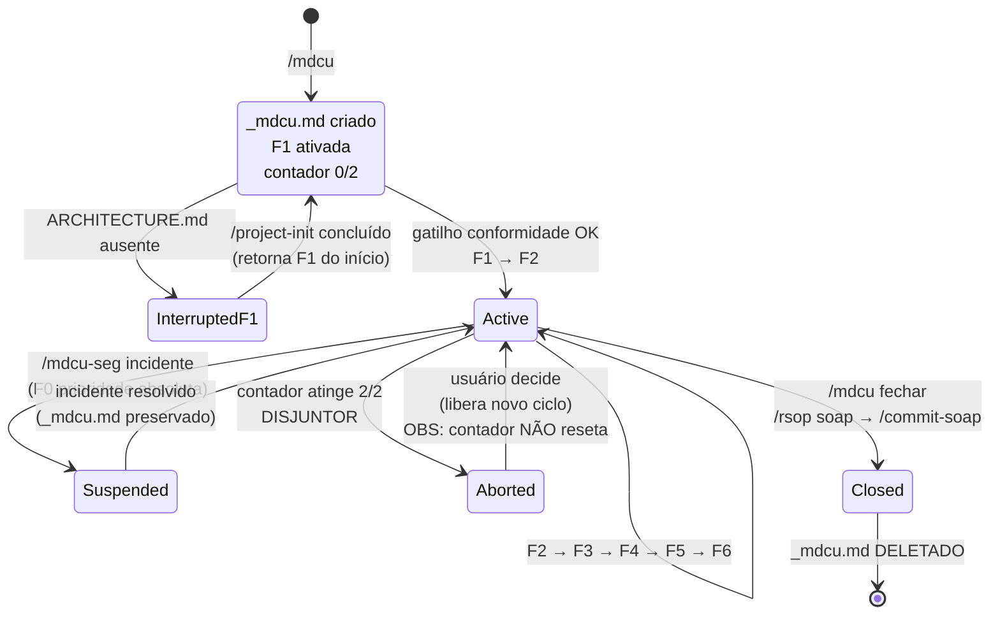
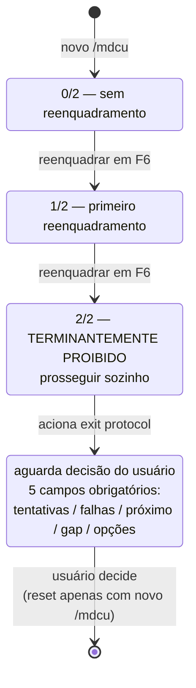
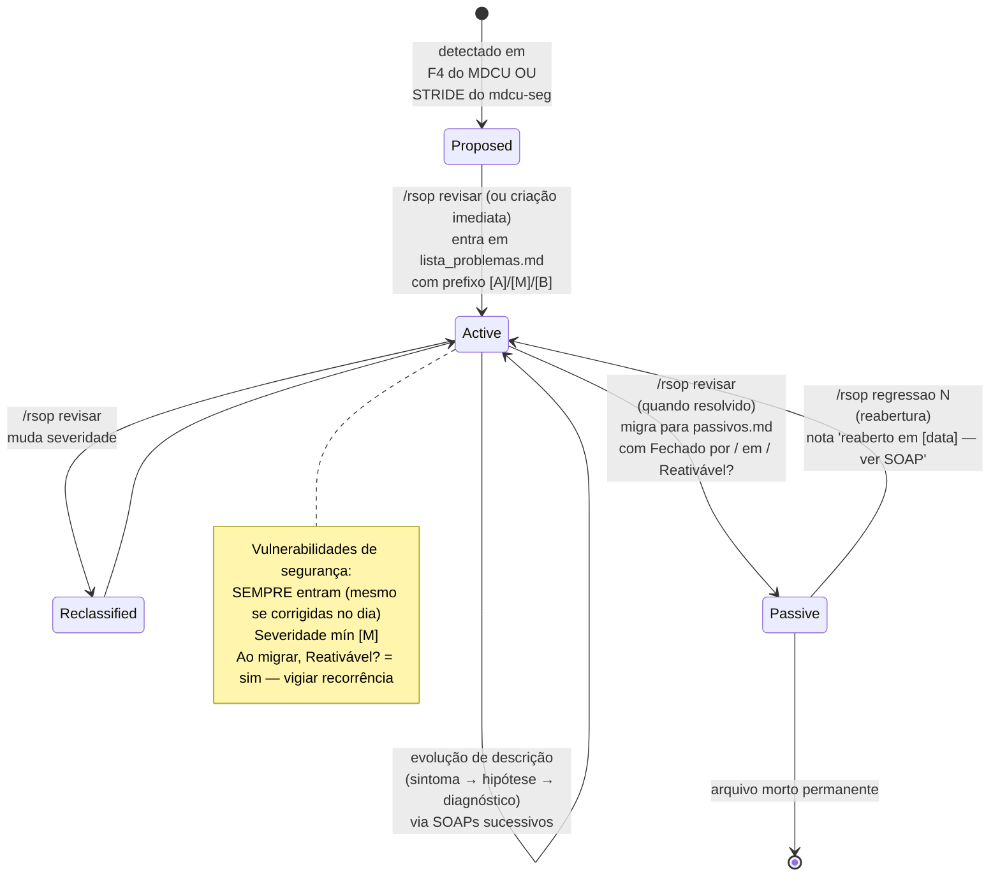
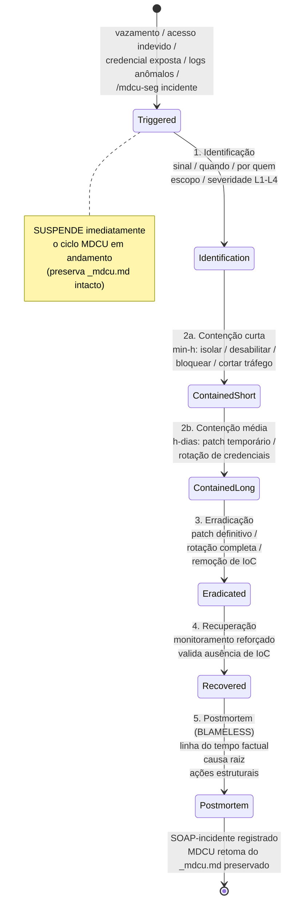
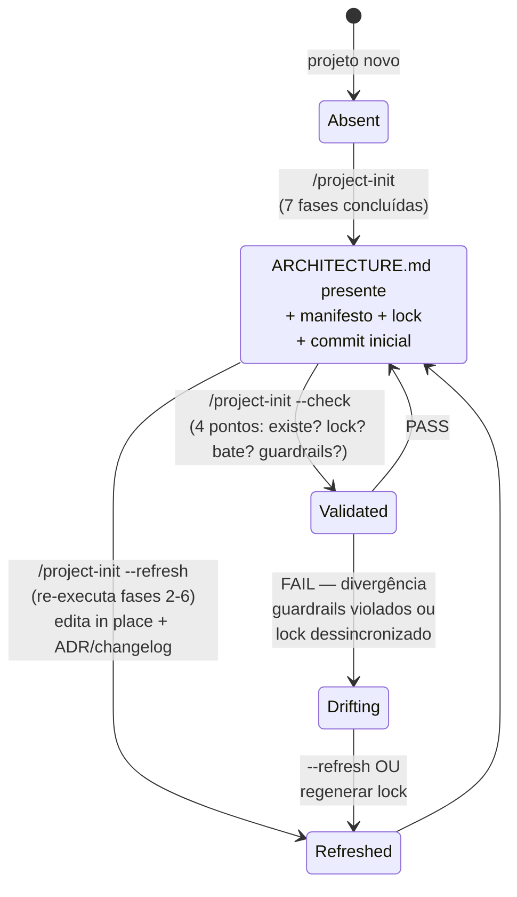
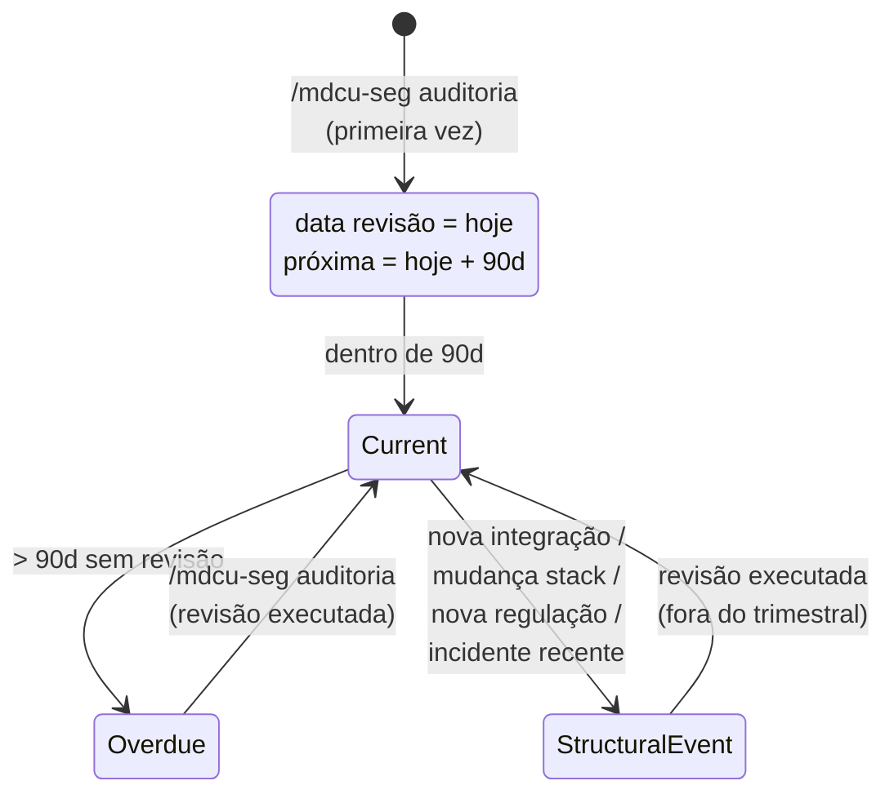
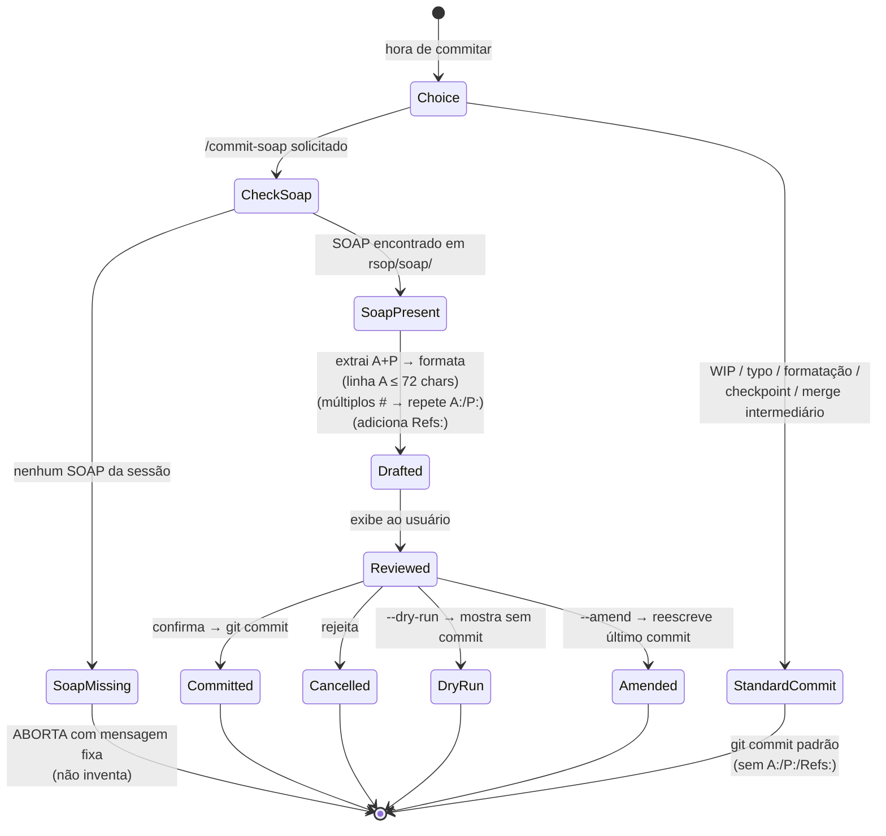

# Máquinas de estado — mdcu-framework

> Gerado pelo **Reversa Detective** em 2026-04-27
> O framework não tem entidades CRUD com `status:` em coluna. As máquinas a seguir são **fluxos de estado prescritivos** sobre artefatos, contadores e protocolos.

---

## SM-1 — Sessão MDCU (`_mdcu.md`)

**Estados:**
- `Created`: arquivo recém-criado, F1 não-completa
- `InterruptedF1`: gate `ARCHITECTURE.md` falhou
- `Active`: ciclo em curso, fase ∈ {F1..F6}
- `Suspended`: F0 em curso (preserva `_mdcu.md`)
- `Aborted`: disjuntor 2/2 disparado
- `Closed`: SOAP + commit emitidos, arquivo será deletado

---

## SM-2 — Contador do Disjuntor (F6)

**Constraints:**
- Reset **apenas** com novo `/mdcu` (criação de novo `_mdcu.md`).
- Decisão do usuário após 2/2 NÃO reseta o contador da sessão atual.
- Exit protocol tem formato fixo de 5 campos (mdcu/SKILL.md:319-336).

---

## SM-3 — Ciclo de vida de um problema RSOP

**Constraints chave:**
- `#` é estável; **nunca reciclado** entre estados.
- Bug pontual resolvido no mesmo dia **não entra** na lista — fica só no SOAP.
- **Exceção segurança:** vulnerabilidade entra mesmo no mesmo dia.
- Consulta a `Passive`: só por suspeita de regressão ou pedido explícito.

---

## SM-4 — Protocolo F0 de Incidente (mdcu-seg)

**Severidade do incidente** (escala paralela a `[A]/[M]/[B]`, **não confundir**):
- `L1` Baixa, contida
- `L2` Média, parcial
- `L3` Alta, confirmada
- `L4` Crítica, ativa em produção

---

## SM-5 — Estado do `ARCHITECTURE.md`

**Note:** o estado `Drifting` é prescritivo, não enforced — depende do agente respeitar o resultado de `--check`.

---

## SM-6 — Auditoria de segurança (`rsop/seguranca.md`)

**Constraints:**
- Período fixo: **90 dias** (mdcu-seg/SKILL.md:202).
- Sem revisão = "ficção administrativa" — citação literal.
- Eventos estruturais disparam revisão fora do calendário.

---

## SM-7 — Mensagem de commit (commit-soap vs. micro-commit)

**Audit:**
- Commits "Committed" são marcos cognitivos (`git log --grep="A:"`).
- Commits "StandardCommit" são ruído operacional (`git log --invert-grep --grep="A:"`).

---

## Achados transversais sobre estado

1. **Disjuntor 2/2 (SM-2) é o único contador persistente** do framework. Vive no header do `_mdcu.md` como string `Tentativas de Reenquadramento: N/2`. Sua persistência é frágil: depende do agente reler o arquivo e respeitar o número.

2. **Estado de "suspensão" do MDCU (SM-1)** é peculiar: o `_mdcu.md` é preservado intacto, mas o agente precisa "lembrar" que está suspenso. Não há lock file ou flag — é estado implícito mantido pela convenção do mdcu-seg de retomar.

3. **`Drifting` em SM-5** revela a tese central do framework: contratos técnicos exigem **vigilância ativa**. `--check` é o "exame de rotina". Sem o exame, o contrato vira ficção.

4. **Reabertura em SM-3** é deliberadamente bidirecional. Outros sistemas tratariam "fechado" como estado terminal — aqui é arquivo morto **reativável**, especialmente para segurança (`reativável? sim — vigiar recorrência`).

5. **Postmortem em SM-4** é estado **blameless por design** — restrição explícita ao tipo de prosa permitida. Único exemplo no framework de regra sobre **estilo do conteúdo**, não sobre estrutura.
